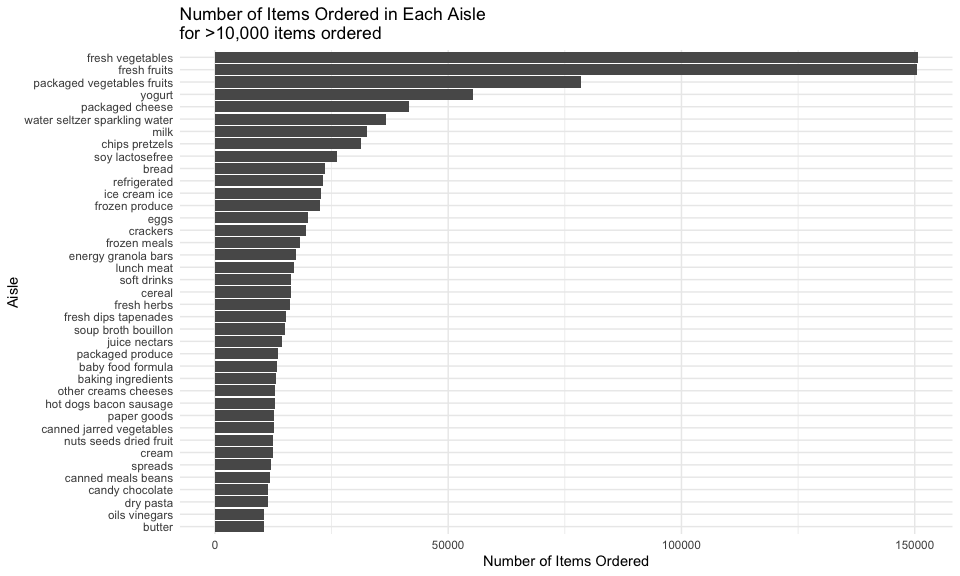
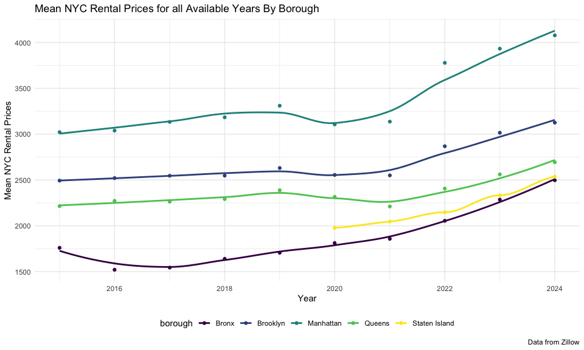
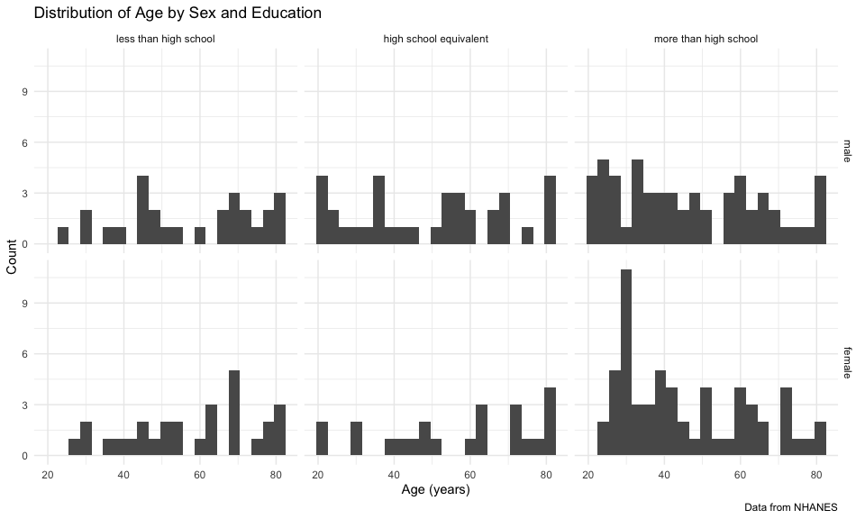
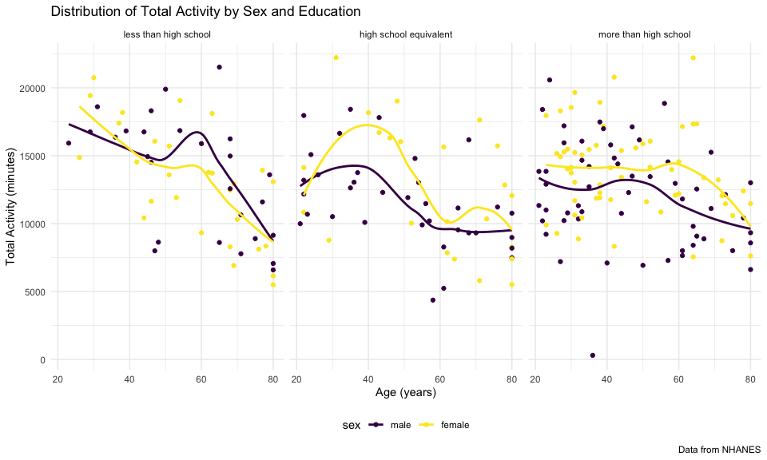

p8105_hw3_kr3145
================
Kallan Roan
2025-10-03

Libraries

``` r
library(tidyverse)
```

    ## ── Attaching core tidyverse packages ──────────────────────── tidyverse 2.0.0 ──
    ## ✔ dplyr     1.1.4     ✔ readr     2.1.5
    ## ✔ forcats   1.0.0     ✔ stringr   1.5.1
    ## ✔ ggplot2   3.5.2     ✔ tibble    3.3.0
    ## ✔ lubridate 1.9.4     ✔ tidyr     1.3.1
    ## ✔ purrr     1.1.0     
    ## ── Conflicts ────────────────────────────────────────── tidyverse_conflicts() ──
    ## ✖ dplyr::filter() masks stats::filter()
    ## ✖ dplyr::lag()    masks stats::lag()
    ## ℹ Use the conflicted package (<http://conflicted.r-lib.org/>) to force all conflicts to become errors

``` r
library(lubridate)
library(patchwork)
library(p8105.datasets)
```

Preset settings for ggplot

``` r
knitr::opts_chunk$set(
  fig.width = 6,
  fig.asp = .6,
  out.width = "90%"
)

theme_set(theme_minimal() + theme(legend.position = "bottom"))

options(
  ggplot2.continuous.colour = "viridis",
  ggplot2.continuous.fill = "viridis"
)

scale_colour_discrete = scale_colour_viridis_d
scale_fill_discrete = scale_fill_viridis_d
```

# Problem 1

Load Instacart Data

``` r
data("instacart")
```

`instacart` dataset has 1384617 observations, each row representing a
product from an order. There are 15 variables. `eval_set` represents the
which evaluation set this orders belongs in, which this data
specifically only includes data from the “train” eval_set.

Some key variables include `order_dow` and `order_hour_of_day`,
representing the day of the week and hour of the day the order was
placed respectively. `days_since_prior_order` order represents the
number of days since the last order, capped at 30 and NA if this is the
customer’s first order. `product_name`, `aisle_name`, and `department`
represents the product, aisle, and department name respectively.
`aisle_id`, `department_id`, `order_id`, `product_id`, and `user_id`
represents the aisle, department, product, and user id respectively.
`add_to_card_order` represents the order in which each product was added
to cart. `reordered` indicates 1 if the product has been ordered in the
past and 0 otherwise. The average order day is 3, representing Thursday.
The average order time is 14:00. For the customers who have ordered from
instacart previously, the average days since the last order is 17 days.

test

How many aisles are there, and which aisles are the most items ordered
from?

``` r
num_aisle_insta = 
  instacart |> 
  group_by(aisle) |> 
  summarize(
    n = n() # counts observations for each group
  ) |> 
  arrange(desc(n)) #arrange in desc order
```

There are 134 different aisles. `fresh vegetables` aisle has the most
items ordered of 150609.

Make a plot that shows the number of items ordered in each aisle,
limiting this to aisles with more than 10000 items ordered. Arrange
aisles sensibly, and organize your plot so others can read it.

????Arrange aisle sensibly??

reorder based on price mutate(neighbourhood = fct_reorder(neighbourhood,
price)) \|\>

``` r
#plot_num_aisle_insta =
  num_aisle_insta |> 
  filter(n > 10000) |> #keep those with 10000 orders
  mutate(aisle = fct_reorder(aisle, n)) |> 
  ggplot(aes(x = aisle, y = n)) + 
  geom_col() +
  labs(
    x = "Aisle",
    y = "Number of Items Ordered", 
    title = "Number of Items Ordered in Each Aisle", 
  ) +
  theme(axis.text.x = element_text(angle = 90, hjust = 1, vjust = 0.5))
```



Make a table showing the three most popular items in each of the aisles
“baking ingredients”, “dog food care”, and “packaged vegetables fruits”.
Include the number of times each item is ordered in your table.

``` r
instacart |> 
  filter(aisle %in% c("baking ingredients", "dog food care", "packaged vegetables fruits")) |> 
  group_by(aisle, product_name) |> 
  summarize(
    n = n()
  ) |> 
  arrange(aisle, desc(n)) |> 
  slice_head(n = 3) |> 
  knitr::kable()
```

    ## `summarise()` has grouped output by 'aisle'. You can override using the
    ## `.groups` argument.

| aisle | product_name | n |
|:---|:---|---:|
| baking ingredients | Light Brown Sugar | 499 |
| baking ingredients | Pure Baking Soda | 387 |
| baking ingredients | Cane Sugar | 336 |
| dog food care | Snack Sticks Chicken & Rice Recipe Dog Treats | 30 |
| dog food care | Organix Chicken & Brown Rice Recipe | 28 |
| dog food care | Small Dog Biscuits | 26 |
| packaged vegetables fruits | Organic Baby Spinach | 9784 |
| packaged vegetables fruits | Organic Raspberries | 5546 |
| packaged vegetables fruits | Organic Blueberries | 4966 |

Make a table showing the mean hour of the day at which Pink Lady Apples
and Coffee Ice Cream are ordered on each day of the week; format this
table for human readers (i.e. produce a 2 x 7 table).

``` r
instacart |> 
  filter(product_name %in% c("Pink Lady Apples", "Coffee Ice Cream")) |> 
  group_by(product_name, order_dow) |> 
  summarize(
    mean_hour_of_day = mean(order_hour_of_day)
  ) |> 
  pivot_wider(
    names_from = order_dow,
    values_from = mean_hour_of_day
  ) |> 
  rename( 
    sunday = `0`,
    monday = `1`,
    tuesday = `2`, 
    wednesday = `3`, 
    thursday = `4`, 
    friday = `5`, 
    saturday = `6` ) |> 
  knitr::kable()
```

    ## `summarise()` has grouped output by 'product_name'. You can override using the
    ## `.groups` argument.

| product_name | sunday | monday | tuesday | wednesday | thursday | friday | saturday |
|:---|---:|---:|---:|---:|---:|---:|---:|
| Coffee Ice Cream | 13.77419 | 14.31579 | 15.38095 | 15.31818 | 15.21739 | 12.26316 | 13.83333 |
| Pink Lady Apples | 13.44118 | 11.36000 | 11.70213 | 14.25000 | 11.55172 | 12.78431 | 11.93750 |

# Problem 2

Read and clean Zip Codes.csv

``` r
zip_code_df = 
  read_csv("data/Zip Codes.csv") |> 
  janitor::clean_names() |> 
  filter(
    !(zip_code == 10463 & county == "New York"),
    !(zip_code == 11201 & county == "New York"))  |> 
  mutate(
    borough = case_match(
      county,
      "Bronx" ~ "Bronx",
      "Kings" ~ "Brooklyn",
      "New York" ~ "Manhattan",
      "Queens" ~ "Queens",
      "Richmond" ~ "Staten Island"
    )
  ) |> 
  select(zip_code, borough, neighborhood)
```

    ## Rows: 322 Columns: 7
    ## ── Column specification ────────────────────────────────────────────────────────
    ## Delimiter: ","
    ## chr (4): County, County Code, File Date, Neighborhood
    ## dbl (3): State FIPS, County FIPS, ZipCode
    ## 
    ## ℹ Use `spec()` to retrieve the full column specification for this data.
    ## ℹ Specify the column types or set `show_col_types = FALSE` to quiet this message.

Read and clean Zip_zori_uc_sfrcondomfr_sm_month_NYC.csv

``` r
zip_zori_df = 
  read_csv("data/Zip_zori_uc_sfrcondomfr_sm_month_NYC.csv") |> 
  pivot_longer(
    -(RegionID:CountyName),
    names_to = "month",
    values_to = "price") |> 
  janitor::clean_names() |> 
  rename(zip_code = region_name) |> 
  mutate(
    month = as_date(month),
    year = floor_date(month, unit = "year"),
    zip_code = as.numeric(zip_code)) |> 
  select(-county_name)
```

    ## Rows: 149 Columns: 125
    ## ── Column specification ────────────────────────────────────────────────────────
    ## Delimiter: ","
    ## chr   (6): RegionType, StateName, State, City, Metro, CountyName
    ## dbl (119): RegionID, SizeRank, RegionName, 2015-01-31, 2015-02-28, 2015-03-3...
    ## 
    ## ℹ Use `spec()` to retrieve the full column specification for this data.
    ## ℹ Specify the column types or set `show_col_types = FALSE` to quiet this message.

Merge zip_zori_df and zip_code_df

``` r
combined_zip_zori_df = 
  left_join(zip_zori_df, zip_code_df, by = "zip_code")
```

There are 116 months between January 2015 and August 2024. How many ZIP
codes are observed 116 times? How many are observed fewer than 10 times?
Why are some ZIP codes are observed rarely and others observed in each
month?

``` r
test =
combined_zip_zori_df |> 
  drop_na(price) |> 
  group_by(zip_code) |> 
  summarize(
    count_per_zip_code = n()
  ) |> 
  count(count_per_zip_code) |> 
  arrange(desc(count_per_zip_code))

#output only those observed less than 10 times
combined_zip_zori_df |> 
  drop_na(price) |> 
  group_by(zip_code) |> 
  summarize(
    count_per_zip_code = n()
  ) |> 
  count(count_per_zip_code) |> 
  filter(count_per_zip_code < 10) |> 
  summarize(sum(less_10_zips = n))
```

    ## # A tibble: 1 × 1
    ##   `sum(less_10_zips = n)`
    ##                     <int>
    ## 1                      26

48 zip codes are observed 116 times. There are 26 zip codes that are
observed less than 10 times. ???more explanation here

Create a reader-friendly table showing the average rental price in each
borough and year (not month). Comment on trends in this table.

``` r
combined_zip_zori_df |> 
  group_by(borough, year) |> 
  summarize(
    mean = mean(price, na.rm = TRUE)
  ) |> 
  mutate(year = year(year)) |> 
  pivot_wider(
    names_from = year,
    values_from = mean
  ) |> 
  knitr::kable()
```

    ## `summarise()` has grouped output by 'borough'. You can override using the
    ## `.groups` argument.

| borough | 2015 | 2016 | 2017 | 2018 | 2019 | 2020 | 2021 | 2022 | 2023 | 2024 |
|:---|---:|---:|---:|---:|---:|---:|---:|---:|---:|---:|
| Bronx | 1759.595 | 1520.194 | 1543.599 | 1639.430 | 1705.589 | 1811.443 | 1857.777 | 2054.267 | 2285.459 | 2496.896 |
| Brooklyn | 2492.928 | 2520.357 | 2545.828 | 2547.291 | 2630.504 | 2555.051 | 2549.890 | 2868.199 | 3015.184 | 3125.657 |
| Manhattan | 3022.042 | 3038.818 | 3133.848 | 3183.703 | 3310.408 | 3106.517 | 3136.632 | 3778.375 | 3932.610 | 4078.440 |
| Queens | 2214.707 | 2271.955 | 2263.303 | 2291.918 | 2387.816 | 2315.632 | 2210.787 | 2406.038 | 2561.615 | 2693.584 |
| Staten Island | NaN | NaN | NaN | NaN | NaN | 1977.608 | 2045.430 | 2147.436 | 2332.934 | 2536.442 |

???explanation

Make a plot showing NYC Rental Prices within ZIP codes for all available
years. Your plot should facilitate comparisons across boroughs. Comment
on any significant elements of this plot.

``` r
ggp_zip_price_all =
combined_zip_zori_df |> 
  drop_na(price) |> 
  group_by(borough, year) |> 
  summarize(
    mean_price = mean(price, na.rm = TRUE)
  ) |> 
  ggplot(aes(x = year, y = mean_price)) +
  geom_point() +
  facet_grid(. ~ borough) +
  labs(
    x = "Year",
    y = "Mean NYC Rental Prices", 
    title = "Mean NYC Rental Prices for all Available Years By Borough", 
    caption = "Data from Zillow"
  ) 
```

    ## `summarise()` has grouped output by 'borough'. You can override using the
    ## `.groups` argument.

``` r
ggp_zip_price_all
```


Compute the average rental price within each ZIP code over each month in
2023. Make a reader-friendly plot showing the distribution of
ZIP-code-level rental prices across boroughs; put differently, your plot
should facilitate the comparison of the distribution of average rental
prices across boroughs. Comment on this plot.

``` r
ggp_zip_price_2023 = 
combined_zip_zori_df |> 
  filter(year(year) == 2023 ) |> 
  group_by(borough, zip_code, month) |> 
  ggplot(aes(x = borough, y = price)) +
  geom_boxplot() +
  labs(
    x = "Borough",
    y = "Mean NYC Rental Prices", 
    title = "Mean NYC Rental Prices in 2023 By Borough", 
    caption = "Data from Zillow"
  ) 

ggp_zip_price_2023
```

    ## Warning: Removed 333 rows containing non-finite outside the scale range
    ## (`stat_boxplot()`).



??comment about boxplot here

Combine the two previous plots into a single graphic, and export this to
a results folder in your repository.

``` r
combine_ggp_zip =
  ggp_zip_price_all / ggp_zip_price_2023 

ggsave("combine_ggp_zip.png", combine_ggp_zip)
```

    ## Saving 6 x 3.6 in image

    ## Warning: Removed 333 rows containing non-finite outside the scale range
    ## (`stat_boxplot()`).

# Problem 3

Load and clean nhanes_covar.csv

``` r
nhanes_covar_df =
  read_csv("data/nhanes_covar.csv",
           skip = 4) |> 
  janitor::clean_names() |> 
  drop_na() |> # drop those with missing demographic data 
  filter(age >= 21) # keep participants >= 21 years old; exclude participants less than 21 years of age
```

    ## Rows: 250 Columns: 5
    ## ── Column specification ────────────────────────────────────────────────────────
    ## Delimiter: ","
    ## dbl (5): SEQN, sex, age, BMI, education
    ## 
    ## ℹ Use `spec()` to retrieve the full column specification for this data.
    ## ℹ Specify the column types or set `show_col_types = FALSE` to quiet this message.

Load and clean nhanes_accel.csv

``` r
nhanes_accel_df =
  read_csv("data/nhanes_accel.csv") |> 
  janitor::clean_names() 
```

    ## Rows: 250 Columns: 1441
    ## ── Column specification ────────────────────────────────────────────────────────
    ## Delimiter: ","
    ## dbl (1441): SEQN, min1, min2, min3, min4, min5, min6, min7, min8, min9, min1...
    ## 
    ## ℹ Use `spec()` to retrieve the full column specification for this data.
    ## ℹ Specify the column types or set `show_col_types = FALSE` to quiet this message.

Merge nhanes_covar.csv and nhanes_accel.csv

``` r
nhanes_covar_accel_df =
  left_join(nhanes_covar_df, nhanes_accel_df, by = c("seqn")) |> 
  janitor::clean_names() |> 
  pivot_longer(
    cols = min1:min1440,
    names_to = "minute",
    values_to = "mims",
    names_prefix = "min"
  ) |> 
  mutate(
    sex = factor(case_match( # convert sex from numeric to factor
      sex,
      1 ~ "male", # add labels
      2 ~ "female"), 
      levels = c("male", "female")),
    education = factor(case_match( # convert education from numeric to factor
      education,
      1 ~ "less than high school", # add labels
      2 ~ "high school equivalent",
      3 ~ "more than high school"),
      levels = c("less than high school", "high school equivalent", "more than high school")),
    minute = as.numeric(minute) # convert minute from character to numeric
  )
```

notes: delete later - seqn: numeric - sex: numeric -\> factor - age:
numeric - bmi: numeric - edu: numeric -\> factor - minute: character -\>
numeric - mims: numeric

Produce a reader-friendly table for the number of men and women in each
education category

``` r
nhanes_covar_accel_df |> 
  group_by(sex, education) |> 
  summarize(
    n = n_distinct(seqn)
  ) |> 
  pivot_wider(
    names_from = education,
    values_from = n
  ) |> 
  knitr::kable()
```

    ## `summarise()` has grouped output by 'sex'. You can override using the `.groups`
    ## argument.

| sex    | less than high school | high school equivalent | more than high school |
|:-------|----------------------:|-----------------------:|----------------------:|
| male   |                    27 |                     35 |                    56 |
| female |                    28 |                     23 |                    59 |

??????Comment on these items.

Create a visualization of the age distributions for men and women in
each education category.

``` r
nhanes_covar_accel_df |>
  distinct(seqn, sex, education, age) |>  
  ggplot(aes(x = age)) +
  geom_histogram() +
  facet_grid(sex ~ education)
```

    ## `stat_bin()` using `bins = 30`. Pick better value with `binwidth`.


??????Comment on these items.

Traditional analyses of accelerometer data focus on the total activity
over the day. Using your tidied dataset, aggregate across minutes to
create a total activity variable for each participant. Plot these total
activities (y-axis) against age (x-axis); your plot should compare men
to women and have separate panels for each education level. Include a
trend line or a smooth to illustrate differences. Comment on your plot.

``` r
nhanes_covar_accel_df |>
  group_by(seqn, sex, education, age) |> 
  summarise(
    total_activity = sum(mims) # calculate total activity by seqn
  ) |> 
  ggplot(aes(x = age, y = total_activity, color = sex)) +
  geom_point() +
  geom_smooth(se = FALSE) +
  facet_grid(. ~ education)
```

    ## `summarise()` has grouped output by 'seqn', 'sex', 'education'. You can
    ## override using the `.groups` argument.
    ## `geom_smooth()` using method = 'loess' and formula = 'y ~ x'



Accelerometer data allows the inspection activity over the course of the
day. Make a three-panel plot that shows the 24-hour activity time
courses for each education level and use color to indicate sex. Describe
in words any patterns or conclusions you can make based on this graph;
including smooth trends may help identify differences.

``` r
nhanes_covar_accel_df |>
  group_by(minute, sex, education) |> 
  summarize(
    activity_time = mean(mims)
  ) |> 
  ggplot(aes(x = minute, y = activity_time, color = sex)) +
  geom_point(alpha = 0.1) +
  geom_smooth(se = FALSE) +
  facet_grid(. ~ education)
```

    ## `summarise()` has grouped output by 'minute', 'sex'. You can override using the
    ## `.groups` argument.
    ## `geom_smooth()` using method = 'gam' and formula = 'y ~ s(x, bs = "cs")'


