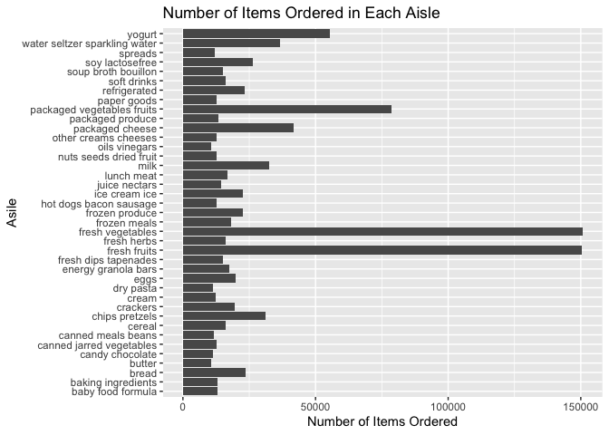

p8105_hw3_kr3145
================
Kallan Roan
2025-10-03

Libraries

``` r
library(tidyverse)
```

    ## ── Attaching core tidyverse packages ──────────────────────── tidyverse 2.0.0 ──
    ## ✔ dplyr     1.1.4     ✔ readr     2.1.5
    ## ✔ forcats   1.0.0     ✔ stringr   1.5.1
    ## ✔ ggplot2   3.5.2     ✔ tibble    3.3.0
    ## ✔ lubridate 1.9.4     ✔ tidyr     1.3.1
    ## ✔ purrr     1.1.0     
    ## ── Conflicts ────────────────────────────────────────── tidyverse_conflicts() ──
    ## ✖ dplyr::filter() masks stats::filter()
    ## ✖ dplyr::lag()    masks stats::lag()
    ## ℹ Use the conflicted package (<http://conflicted.r-lib.org/>) to force all conflicts to become errors

``` r
library(p8105.datasets)
```

# Problem 1

Load Instacart Data

``` r
data("instacart")
```

# Short description of dataset

- size and structure of data
- describe key variables
- give illustrative examples of observations

`instacart` dataset has 1384617 observations, each row representing a
product of from an order. 15 variables.

How many aisles are there, and which aisles are the most items ordered
from?

``` r
num_aisle_insta = 
  instacart |> 
  group_by(aisle) |> 
  summarize(
    n = n() # counts observations for each group
  ) |> 
  arrange(desc(n)) #arrange in desc order
```

There are 134 different aisles. `fresh vegetables` aisle has the most
items ordered of 150609.

Make a plot that shows the number of items ordered in each aisle,
limiting this to aisles with more than 10000 items ordered. Arrange
aisles sensibly, and organize your plot so others can read it.

????Arrange aisle sensibly??

``` r
#plot_num_aisle_insta =
  num_aisle_insta |> 
  filter(n > 10000) |> #keep those with 10000 orders
  ggplot(aes(x = aisle, y = n)) + 
  geom_col() +
  coord_flip() +
  labs(
    x = "Asile",
    y = "Number of Items Ordered", 
    title = "Number of Items Ordered in Each Aisle", 
  ) 
```

<!-- -->

Make a table showing the three most popular items in each of the aisles
“baking ingredients”, “dog food care”, and “packaged vegetables fruits”.
Include the number of times each item is ordered in your table.

``` r
instacart |> 
  filter(aisle %in% c("baking ingredients", "dog food care", "packaged vegetables fruits")) |> 
  group_by(aisle, product_name) |> 
  summarize(
    n = n()
  ) |> 
  arrange(aisle, desc(n)) |> 
  slice_head(n = 3) |> 
  knitr::kable()
```

    ## `summarise()` has grouped output by 'aisle'. You can override using the
    ## `.groups` argument.

| aisle | product_name | n |
|:---|:---|---:|
| baking ingredients | Light Brown Sugar | 499 |
| baking ingredients | Pure Baking Soda | 387 |
| baking ingredients | Cane Sugar | 336 |
| dog food care | Snack Sticks Chicken & Rice Recipe Dog Treats | 30 |
| dog food care | Organix Chicken & Brown Rice Recipe | 28 |
| dog food care | Small Dog Biscuits | 26 |
| packaged vegetables fruits | Organic Baby Spinach | 9784 |
| packaged vegetables fruits | Organic Raspberries | 5546 |
| packaged vegetables fruits | Organic Blueberries | 4966 |

Make a table showing the mean hour of the day at which Pink Lady Apples
and Coffee Ice Cream are ordered on each day of the week; format this
table for human readers (i.e. produce a 2 x 7 table).

``` r
instacart |> 
  filter(product_name %in% c("Pink Lady Apples", "Coffee Ice Cream")) |> 
  group_by(product_name, order_dow) |> 
  summarize(
    mean_hour_of_day = mean(order_hour_of_day)
  ) |> 
  pivot_wider(
    names_from = order_dow,
    values_from = mean_hour_of_day
  ) |> 
  rename( 
    sunday = `0`,
    monday = `1`,
    tuesday = `2`, 
    wednesday = `3`, 
    thursday = `4`, 
    friday = `5`, 
    saturday = `6` ) |> 
  knitr::kable()
```

    ## `summarise()` has grouped output by 'product_name'. You can override using the
    ## `.groups` argument.

| product_name | sunday | monday | tuesday | wednesday | thursday | friday | saturday |
|:---|---:|---:|---:|---:|---:|---:|---:|
| Coffee Ice Cream | 13.77419 | 14.31579 | 15.38095 | 15.31818 | 15.21739 | 12.26316 | 13.83333 |
| Pink Lady Apples | 13.44118 | 11.36000 | 11.70213 | 14.25000 | 11.55172 | 12.78431 | 11.93750 |
